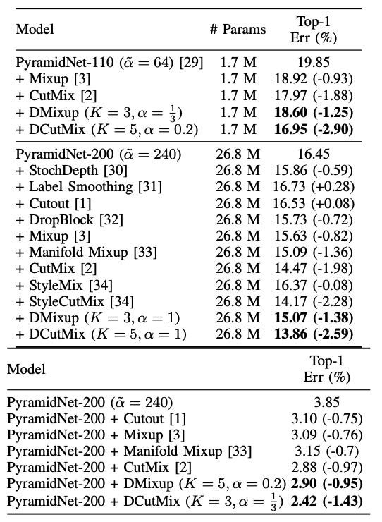
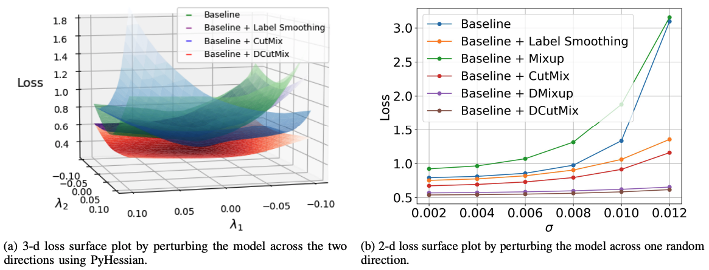

# DCutMix-PyTorch

Official PyTorch Implementation of the paper "[Observations on K-Image Expansion of Image-Mixing Augmentation](https://arxiv.org/abs/2110.04248)"

Joonhyun Jeong, Sungmin Cha, Youngjoon Yoo, Sangdoo Yun, Taesup Moon, Jongwon Choi.

## Abstract

Image-mixing augmentations (e.g., Mixup and CutMix), which typically involve mixing two
images, have become the de-facto training techniques for image classification. Despite their huge success in image classification, the number of images to be mixed has not been elucidated in the literature: only the naive K-image expansion has been shown to lead to performance degradation. This study derives a new K-image mixing augmentation based on the stick-breaking process under Dirichlet prior distribution. We demonstrate the superiority of our K-image expansion augmentation over conventional two-image mixing augmentation methods through extensive experiments and analyses: 1) more robust and generalized classifiers; 2) a more desirable loss landscape shape; 3) better adversarial robustness. Moreover, we show that our probabilistic model can measure the sample-wise uncertainty and boost the efficiency for network architecture search by achieving a 7-fold reduction in the search time.




## Getting Started
### Preliminary environments
- pytorch 1.13.0
- torchvision 0.14.0
- cuda 11.7 / cudnn 8.4.1

```shell
pip install -r requirements.txt
```

### Training with DCutMix on CIFAR100 (PyramidNet-110)

```shell
python3 main.py --root [CIFAR100_ROOT_DIRECTORY] --alpha 0.2 --trial 5 --beta 1.0 --num_classes 100 --lr 0.25 --batch_size 64 --wd 4e-5 --mode dcutmix --model pyramidnet
```

### Training with DCutMix on CIFAR100 (PyramidNet-200)
```shell
python3 main.py --root [CIFAR100_ROOT_DIRECTORY] --alpha 1.0 --trial 5 --beta 0.5 --num_classes 100 --lr 0.25 --batch_size 64 --wd 4e-5 --mode dcutmix --model pyramidnet_200_240
```

### Training with DCutMix on CIFAR10 (PyramidNet-200)
```shell
python3 main.py --root [CIFAR10_ROOT_DIRECTORY] --alpha 0.33333333333 --trial 3 --beta 1 --num_classes 10 --lr 0.25 --batch_size 64 --wd 4e-5 --mode dcutmix --model pyramidnet_200_240
```

### Reproducing DCutMix on CIFAR100 (PyramidNet-110)
- DCutMix (K=5, alpha=0.2) / PyramidNet-110 / Top-1 error 16.95% on CIFAR100:
```shell
python3 main.py --root [CIFAR100_ROOT_DIRECTORY] --num_classes 100 --batch_size 64 --model pyramidnet --eval_ckpt_path checkpoint/dcutmix_pyramidnet110_cifar100_top1_16.95.pth
```

## Citation
```
@article{jeong2021observations,
  title={Observations on k-image expansion of image-mixing augmentation for classification},
  author={Jeong, Joonhyun and Cha, Sungmin and Yoo, Youngjoon and Yun, Sangdoo and Moon, Taesup and Choi, Jongwon},
  journal={arXiv preprint arXiv:2110.04248},
  year={2021}
}
```

## License
```
Copyright (c) 2023-present NAVER Cloud Corp.

Licensed under the Apache License, Version 2.0 (the "License");
you may not use this file except in compliance with the License.
You may obtain a copy of the License at

    http://www.apache.org/licenses/LICENSE-2.0

Unless required by applicable law or agreed to in writing, software
distributed under the License is distributed on an "AS IS" BASIS,
WITHOUT WARRANTIES OR CONDITIONS OF ANY KIND, either express or implied.
See the License for the specific language governing permissions and
limitations under the License.
```
